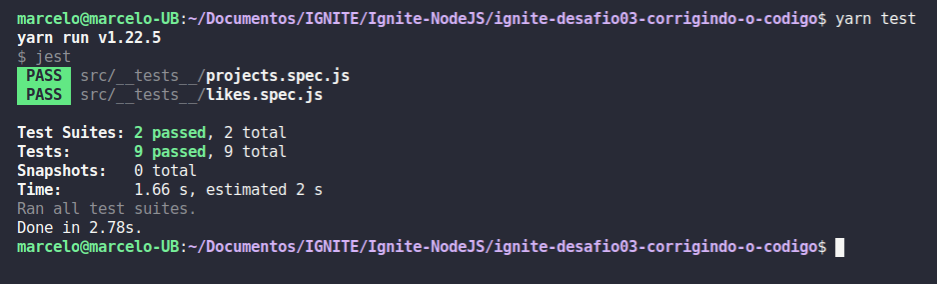

# ignite-desafio03-corrigindo-o-codigo

Desafio 03 - Corrigindo o código

<h1 align="center">
    
</h1>

Nesse desafio foi colocado uma aplicação Node.js, que após algumas alterações no código da aplicação, parte dos testes deixaram de passar, exigindo assim que o desensenvolvedor encontre e arrume a aplicação. Para treinar o que foi aprendido até agora na trilha Node.js!

Essa aplicação realiza o CRUD (Create, Read, Update, Delete) de repositórios de projetos. Além disso, é possível dar likes em repositórios cadastrados, aumentando a quantidade de likes em 1 a cada vez que a rota é chamada.

Testes de repositórios

- **Should be able to create a new repository**
- **Should be able to list the projects**
- **Should be able to update repository**
- **Should not be able to update a non existing repository**
- **Should not be able to update repository likes manually**
- **Should be able to delete the repository**
- **Should not be able to delete a non existing repository**

Testes de likes

- **Should be able to give a like to the repository**
- **Should not be able to give a like to a non existing repository**

## Rotas da aplicação

### GET `/repositories`

A rota deve retornar uma lista contendo todos os repositórios cadastrados.

### POST `/repositories`

A rota deve receber `title`, `url` e `techs` pelo corpo da requisição e retornar um objeto com as informações do repositório criado e um status `201`.

### PUT `/repositories/:id`

A rota deve receber `title`, `url` e `techs` pelo corpo da requisição e o `id` do repositório que deve ser atualizado pelo parâmetro da rota. Deve alterar apenas as informações recebidas pelo corpo da requisição e retornar esse repositório atualizado.

### DELETE `/repositories/:id`

A rota deve receber, pelo parâmetro da rota, o `id` do repositório que deve ser excluído e retornar um status `204` após a exclusão.

### POST `/repositories/:id/like`

A rota deve receber, pelo parâmetro da rota, o `id` do repositório que deve receber o like e retornar o repositório com a quantidade de likes atualizada.

https://www.notion.so/Desafio-03-Corrigindo-o-c-digo-c15c8a2e212846039a367cc7b763c6dd

